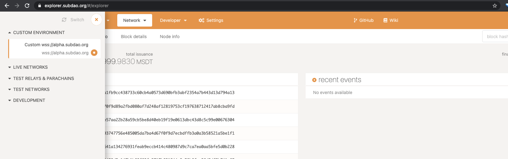
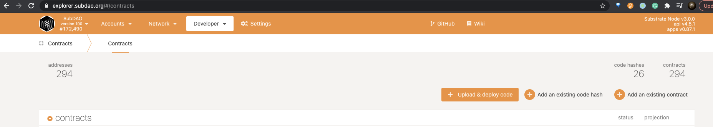
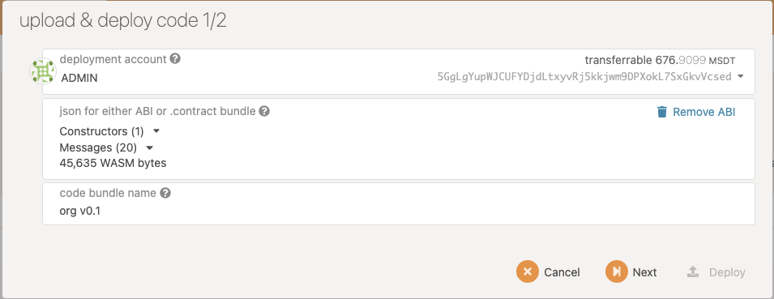
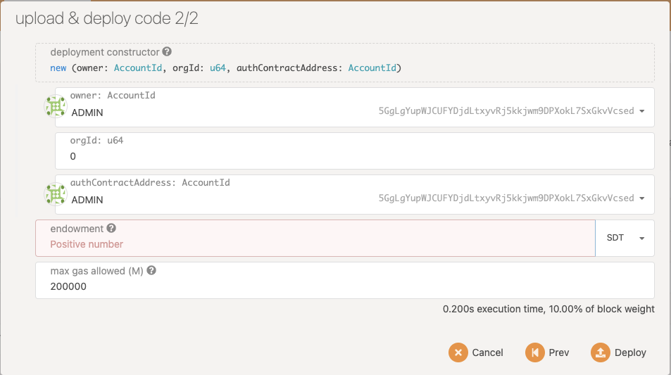
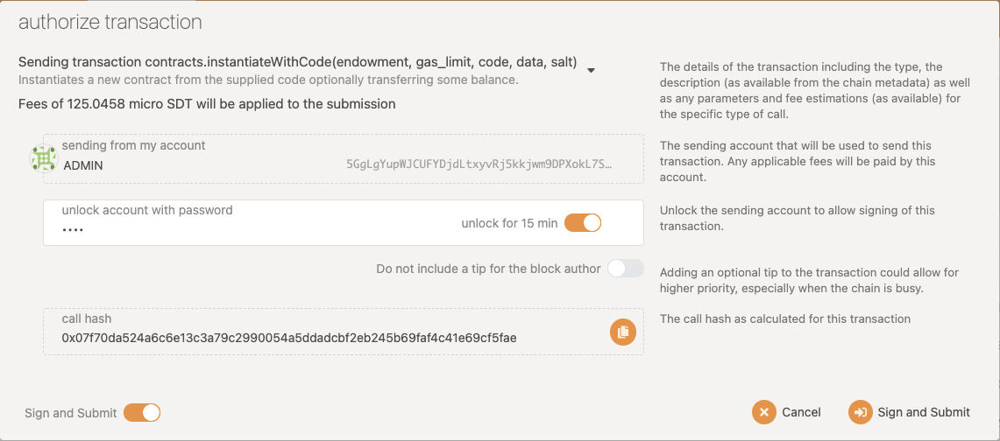
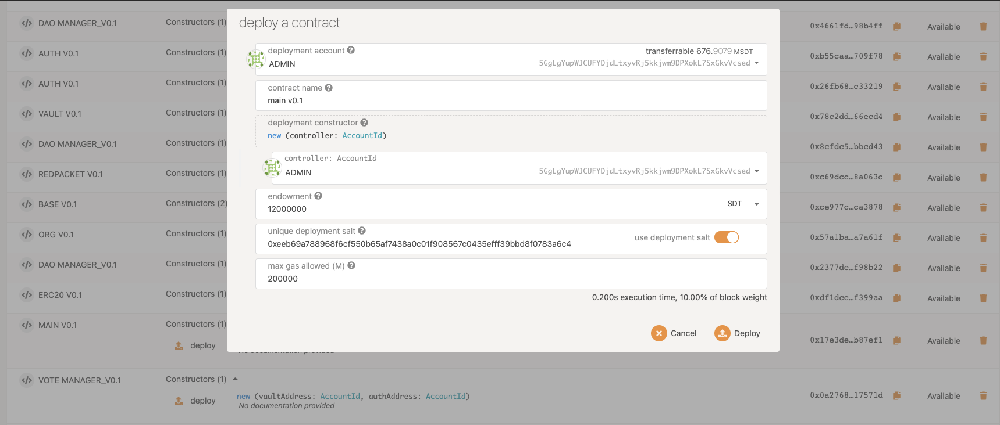
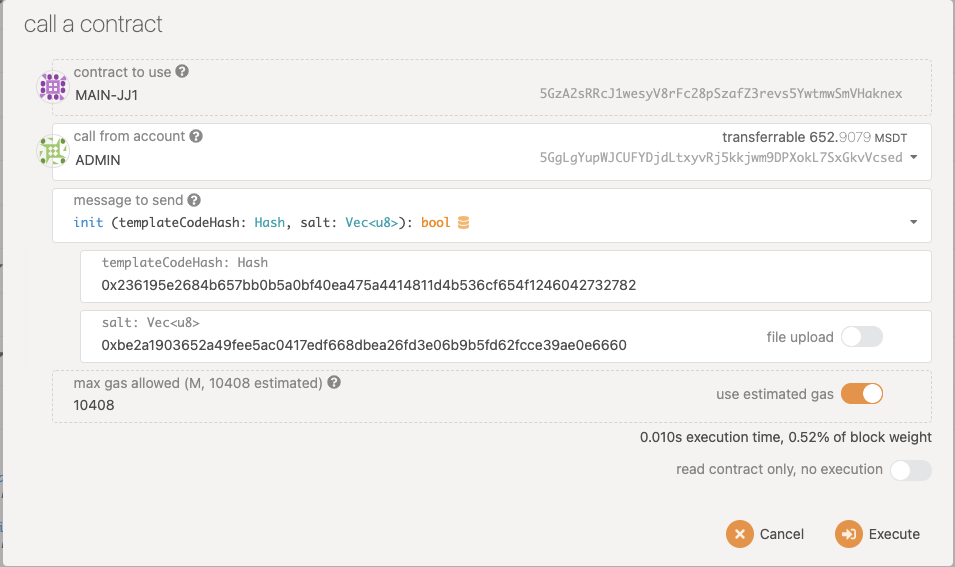
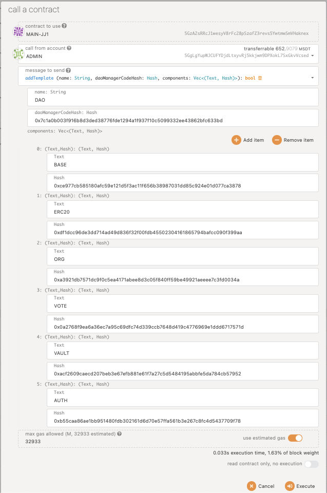

# Deployment Guide

SubDAOis a DAO platform based on WEB3 ecology, which can quickly create your own DAO organization based on a series of template contracts provided bySubDAO. This document will tell you what the SubDAO consists of and how to deploy them.

## Contract Structure

SubDAO’s contract address:[https://github.com/SubDAO-Network/subDAO-contracts](https://github.com/SubDAO-Network/subDAO-contracts)

### SubDAO Main Module

SubDAOMain is the base contract for SubDAO, developed by SubDAO Labs to manage the Template and Module that SubDAO supports. SubDAOMain'sfeaturesincludeTemplate Library management, Module Library management, and Dao creation.

### SubDAO Template Module

AllDAOsare created from Template, and all supported modules are recorded in Template. The Template functionality includes the creation of theDAO, the creation process for defining the DAO, and the supported Module functionality.

### SubDAO Base Module

The basic information of the DAO is managedbyBase Module, which contains the name,logo, organization description, and creator of the DAO organization.

### SubDAO Org Module

There are different forms of organization for any organization, but there must be its founders, its managers, and its participants. The SubDAOOrg Module provides a flexible way to distinguish between membership and the responsibilities of Dao community governance. The current version includesthe identity division and responsibility setting of different members in a minimal way, and the membership is divided into three identities: creator, manager and participant.

### SubDAO Vault Module

The operation of the DAO organization needsfinancial support, mainly for the DAO members to contribute togetrewards. The management of money needs to be done in a democratic way. Not everyone can manage money, only the founders and managers, or by voting. The money in the Vault comes from outside donations, and Native tokens and ERC20 tokens can be supported depending on the settings.

### SubDAO Voting Module

Voting with any organization is the basis for the implementation of democracy, only with the Voting capacity and mechanisms to constitute a DAO. In SubDAO Voting Module provides Voting-related functions, allowing any member that can initiate Voting to initiate Voting and set Voting rules. All members can vote using Token.

### SubDAO Token Module

In DAOorganization, Token is the symbol of rights and power, through Token can exercise the power of community governance, through Token can get the reward after contribution. In SubDAO, the SubDAO Token Module provides functions related to Token management, such as Token issuance, Tokenminting, Token destruction, Token transfer, and so on. In the SubDAO Token Module, Token currently follows the ERC20 standard.

### SubDAO Auth Module

The main function of Auth Module is to provide a flexible permission management, which can give different permissions to each address, such as creating votes and participating in voting.

### SubDAO DAO Manage Module

DAO Manager is mainly used to manage the contract addresses owned in DAO.

## Contract compilation

SubDAO provides scripts to simplify the contract compilation process while collecting the editing results into a unified directory to facilitate contract deployment and usage. Execute in the project root directory

```bash

./build.sh

```

All contract compilation results are saved in the `release` directory.

## Contract deployment

SubDAO createsasubstrate chain to connect toPOLKADOT Ecology, and all contracts are deployed on SubDAO chain. This section explains how to deploy contracts using the front end ([https://explorer.](https://explorer.s)[subda](https://explorer.subdao)[o](https://explorer.subdao).org/) .

### ConnectSubDAO node

Visit the front page:[https://explorer.subdao.org/](https://explorer.subdao.org/).



### Manually upload the contract

Enter developer-> Contracts and click Upload WASM.



Select the contract file, or the ABI file and WASM file, and click Upload, Sign and Submit.





You must fill in the appropriate endowment and click deploy.



Up Next, sign and submit. Wait a moment and the contract code will be uploaded.

### Deployingcontract

After upload the contract, you can instantiate the contract on the chain. In substrate, you need to perform the contract’s initialization function, usually new or default function.

ForSubDAO contracts, all contracts are instantiated by the main contract. So the only contractSubDAO really needs to be deployed is the main contract. The main contract is responsible for managing contract templates and DAOinstantiations.



Select initialization function, fill in the initialization parameters, set the main contract administrator, and set the contract initial balance, click Deploy. Note that the deployment salt isneeded.

## Use contract

### Main contract initialization

The main contract manages the DAO templates andDAOinstantiations. After the main contract is deployed, need to initialize the template management function of Main, call the init function, and set the code and salt of the contract template.



### AddDAOtemplates

For now,DAOtemplates can only be configured in the tool by calling the addTemplate function in the main contract, setting the code for the DAOmanager contract, and the code for the components in the template.

For example, we create a DAO template withtokenmanagement, token, organization management, voting, authorization, and can set the name for the template.

After adding theDAOtemplate,we cancreate DAO organizationwithSubDAO dapp.


